# Smart Grid Energy Monitoring & Billing — Lambda Architecture Pipeline

EC8203 Applied Big Data Engineering — Mini Project (**Use Case 3: Smart Grid Energy Monitoring & Billing**).

An end-to-end data platform that ingests smart-meter telemetry in real time
(Kafka → Spark Structured Streaming) and a daily tariff/billing extract in
batch (Airflow → Spark), stores both in a Parquet lake + PostgreSQL, and
serves a live dashboard, a REST API and scheduled daily report files that
answer:

> **What is the current grid load and renewable contribution by zone, and
> what will each household's bill look like once daily tariff data is
> applied to their consumption?**

| | |
|---|---|
| 📄 **Technical report** | [`smart-grid-pipeline/report/EC8203_MiniProject_Report.pdf`](smart-grid-pipeline/report/EC8203_MiniProject_Report.pdf) |
| 🎬 **Demo script** | [`smart-grid-pipeline/docs/DEMO_SCRIPT.md`](smart-grid-pipeline/docs/DEMO_SCRIPT.md) |
| 💻 **Source code** | [`smart-grid-pipeline/`](smart-grid-pipeline/) |

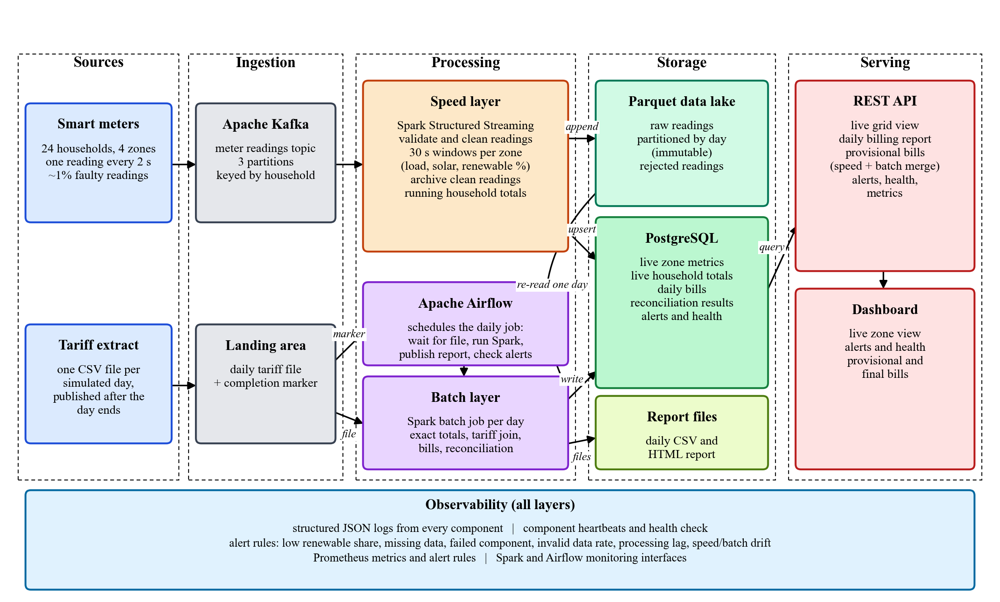

---

## Contents

1. [Architecture: Lambda (and why not Kappa)](#architecture-lambda-and-why-not-kappa)
2. [Tech stack](#tech-stack)
3. [How the data flows](#how-the-data-flows)
4. [Simulated clock and assumptions](#simulated-clock-and-assumptions)
5. [Quick start](#quick-start)
6. [Where to look once it is running](#where-to-look-once-it-is-running)
7. [REST API](#rest-api)
8. [Useful terminal commands](#useful-terminal-commands)
9. [Verifying the results](#verifying-the-results)
10. [Observability](#observability)
11. [Configuration](#configuration)
12. [Screenshots](#screenshots)
13. [Repository layout](#repository-layout)
14. [Troubleshooting](#troubleshooting)
15. [Limitations](#limitations)
16. [Team](#team)

---

## Architecture: Lambda (and why not Kappa)

| Layer | What it does here | Guarantees |
|---|---|---|
| **Speed** | Spark Structured Streaming reads Kafka, validates events, computes 30 s windows (15 s slide, 1 min watermark) of load / solar / renewable % per zone, appends clean events to the Parquet lake, keeps running per-household totals | seconds of latency, **approximate** (dedup only within a micro-batch, additive totals) |
| **Batch** | Airflow runs a Spark job for every finished simulated day: global dedup on `event_id`, exact household totals from the immutable lake, tariff validation + fallback, join, bill, reconciliation against the speed layer | **exact and replayable** (idempotent per-day overwrite in one transaction) |
| **Serving** | FastAPI merges both views at query time — e.g. `/api/billing/projection` = speed-layer consumption × batch-validated tariff | |

**Why not Kappa?** The tariff feed is a once-a-day snapshot, not a stream;
billing needs an exact, auditable, cheaply re-runnable daily recomputation
(re-read one lake partition instead of replaying the whole Kafka log); and a
single stateful streaming job joining a continuous stream with a daily file
would be harder to get right and to test. Full argument in the report
(section 2).

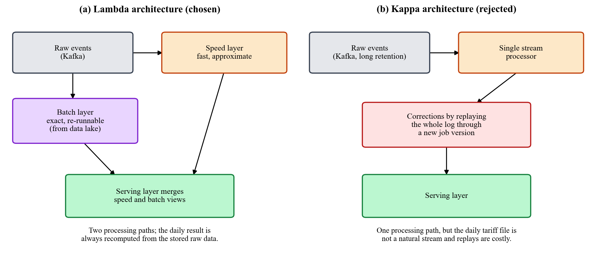

## Tech stack

| Layer | Tool | Why (tied to this use case) |
|---|---|---|
| Ingestion | **Apache Kafka 3.7 (KRaft)** — topic `smart-meter-readings`, 3 partitions, key = `household_id` | durable, replayable buffer for high-frequency telemetry; keying preserves per-household order while spreading load across partitions; 7-day retention lets the speed layer recover after downtime |
| Stream processing | **Spark Structured Streaming 3.5** | event-time windows + watermarks for late data, checkpointed offsets, and the *same* engine/DataFrame API as the batch job |
| Orchestration | **Apache Airflow 2.9** | the daily reconciliation is a dependency chain (wait for file → Spark job → report → alert check) that needs retries, backfill and a UI |
| Batch source of truth | **Parquet data lake**, partitioned by `sim_day` | immutable, columnar, and the batch job reads exactly one partition per day |
| Serving store | **PostgreSQL 16** | small, relational outputs queried with filters/joins; upserts + transactions make both layers idempotent |
| Serving | **FastAPI** + static dashboard | typed REST API with OpenAPI docs at `/docs`; the dashboard only uses the public API |
| Observability | JSON logs, heartbeats, rule engine, **Prometheus** | see [Observability](#observability) |
| Packaging | **Docker Compose** | the whole platform (9 containers) starts with one command |

## How the data flows

1. **Streaming source** (`sources/smart_meter_producer.py`) — 24 households in
   4 zones each send a JSON reading every 2 s to Kafka topic
   `smart-meter-readings` (3 partitions, keyed by `household_id`). About 1% of
   events are deliberately dirty.
2. **Speed layer** (`processing/speed_layer_spark.py`) — two Structured
   Streaming queries:
   * `zone_metrics`: 30 s sliding windows per zone → upserted into `live_zone_metrics`;
   * `raw_lake`: invalid events → quarantine Parquet (with reason); clean
     events → raw Parquet lake partitioned by `sim_day`; running per-household
     totals → `live_household_consumption`; quality/lag figures → `stream_quality_metrics`.
3. **Daily-batch source** (`sources/tariff_batch_source.py`) — 20 s after
   each simulated day ends, drops `tariff_simday<N>.csv` and then a
   `_SUCCESS_simday<N>` marker.
4. **Batch layer** — the Airflow DAG `daily_batch_pipeline` polls every
   minute:
   `resolve_sim_day → wait_for_tariff_file → run_batch_layer → publish_report → run_alert_check → notify_complete`.
   The Spark job (`processing/batch_layer_spark.py`) dedups the day's lake
   partition, validates the tariff file, joins, bills, reconciles and writes
   the whole day to PostgreSQL in one transaction.
5. **Serving** — FastAPI (`serving/api/main.py`) serves the speed view, the
   batch view and their merge; the dashboard, report files and Prometheus
   consume it.

## Simulated clock and assumptions

* **1 simulated day = 300 s (5 min) of real time** (`SIMULATED_DAY_SECONDS`).
  Day numbering is anchored to one epoch written to Postgres (`sim_clock`)
  when the database is created, so every container agrees on
  `sim_day = floor((event_time − epoch) / 300 s)`. Day fraction 0.5 = noon;
  daylight (for alerting) is fraction 0.40–0.60.
* Each of 24 households (4 zones) emits a reading every 2 s. Consumption has
  morning/evening peaks; solar follows a daylight curve scaled by zone
  capacity (South has few panels) and daily cloud cover; each day one zone
  gets an overcast spell (this drives the `LOW_RENEWABLE` alert).
* ~1% of events are deliberately dirty (missing field, negative, impossible
  value, bad timestamp, duplicate); ~1 in 3 tariff files contains an invalid
  row and some contain a duplicated household. The pipeline must handle them.
* The tariff extract for day *N* is published 20 s after day *N* ends; the
  bill for day *N* is therefore available ~1 min after the day closes.
* Billing: `bill = max(consumption − solar, 0) × tariff × (1 − 15% if subsidised)`;
  no export credit. Renewable contribution = solar ÷ demand (capped at 100%).
* Currency is LKR; all data is synthetic.

---

## Quick start

### Prerequisites

* **Docker Desktop** with about **6 GB of RAM** allocated to Docker
* **Git**
* **Python 3.10+** (only needed to run the tests and the smoke test on the host)
* These ports free on your machine: `8000, 8001, 8080, 9090, 4040, 5433, 29092`

### 1. Clone and enter the project

```bash
git clone <this-repository-url>
cd BigData/smart-grid-pipeline
```

> Every command in this README is run from the **`smart-grid-pipeline/`** folder.

### 2. (Optional) Override the defaults

```bash
cp .env.example .env
```

Edit `.env` to change, for example, the length of a simulated day or the
alert thresholds (see [Configuration](#configuration)).

### 3. Build and start the whole platform

```bash
docker compose up --build -d
```

The first build downloads the images and Spark's Kafka connector, so it takes
a few minutes. After that:

| When | What you'll see |
|---|---|
| ~30 s | live data on the dashboard |
| ~5 min | end of simulated day 0 |
| ~6 min | the first daily bill and report file |

### 4. Check that everything is up

```bash
docker compose ps
```

All 9 services should be `running` (Kafka, Postgres and the API also show `healthy`).

### 5. Open the dashboard

Go to **http://localhost:8000/**.

### Stop / tear down

```bash
docker compose stop          # pause everything, keep containers and data
docker compose down          # remove containers, keep data volumes
docker compose down -v       # also delete Kafka / Postgres / lake volumes (fresh sim clock, day 0 again)
```

---

## Where to look once it is running

| What | URL | Notes |
|---|---|---|
| **Dashboard** | http://localhost:8000/ | live grid view, alerts, pipeline health, provisional + final bills |
| API docs (OpenAPI / Swagger) | http://localhost:8000/docs | try every endpoint from the browser |
| Health check | http://localhost:8000/health | `OK` or `DEGRADED` + per-component status |
| Prometheus metrics (API) | http://localhost:8000/metrics | scraped by Prometheus |
| **Airflow UI** | http://localhost:8080 | login `admin` / `admin`; DAG `daily_batch_pipeline` is unpaused automatically |
| **Prometheus** | http://localhost:9090/alerts | alert rules; targets at `/targets` |
| **Spark UI** | http://localhost:4040 | **Structured Streaming** tab shows the two streaming queries |
| Producer metrics | http://localhost:8001/ | delivered / failed event counters |
| PostgreSQL | `localhost:5433` | database, user and password are all `smartgrid` |
| Daily report files | `smart-grid-pipeline/reports/` | `daily_report_simday<N>.html` + `daily_billing_report_simday<N>.csv` |
| Log files | `smart-grid-pipeline/logs/` | one JSON-lines file per component |

## REST API

All endpoints are `GET`. Full, interactive documentation at http://localhost:8000/docs.

| Endpoint | View | Returns |
|---|---|---|
| `/api/grid/live` | speed | latest complete 30 s window per zone: load, solar, renewable %, low-renewable flag |
| `/api/grid/history?minutes=15` | speed | zone windows over the last N minutes (1–360) |
| `/api/households/live?sim_day=N` | speed | running consumption per household for the day (default: today) |
| `/api/billing/daily?sim_day=N&household_id=H-001` | batch | final bills (default: last billed day) |
| `/api/billing/summary?sim_day=N` | batch | per-zone roll-up of bills and solar contribution |
| `/api/billing/days` | batch | the list of billed days |
| `/api/reconciliation?limit=10` | batch | speed-vs-batch drift and data-quality counters per day |
| `/api/billing/projection?household_id=H-001` | **merge** | provisional bill so far today = speed consumption × batch-validated tariff |
| `/api/alerts?resolved=false&limit=50` | observability | open (or resolved) alerts |
| `/api/pipeline/status` | observability | heartbeats, stream quality, last reconciliation |
| `/health` | observability | overall `OK` / `DEGRADED` |
| `/metrics` | observability | Prometheus exposition format |

Example calls:

```bash
curl http://localhost:8000/api/grid/live
curl "http://localhost:8000/api/billing/projection?household_id=H-001"
curl "http://localhost:8000/api/billing/daily?sim_day=2"
curl http://localhost:8000/health
```

> On Windows PowerShell, `curl` is an alias; use `curl.exe` or simply open the URLs in a browser.


| Table | Written by | Holds |
|---|---|---|
| `sim_clock` | `init.sql` | the shared simulated-clock epoch |
| `live_zone_metrics` | speed layer | 30 s windowed load / solar / renewable % per zone |
| `live_household_consumption` | speed layer | running per-household totals for the current day |
| `stream_quality_metrics` | speed layer | per-micro-batch counts, invalid reasons, lag |
| `household_daily_consumption` | batch layer | exact daily totals per household |
| `tariff_reference` | batch layer | validated tariff per household and day |
| `daily_billing_report` | batch layer | final bill per household and day |
| `batch_reconciliation` | batch layer | speed-vs-batch drift + data-quality counters per day |
| `alerts` | alert engine | open and resolved alerts |
| `pipeline_health` | every component | heartbeats |


## Verifying the results

### Unit tests (no Docker needed)

```bash
pip install -r requirements.txt
pytest tests -v        # 44 unit tests
```

They cover the data-quality rules, the billing formula, the simulated clock,
both data simulators, the alert rules, the API (with a stubbed database) and
the report renderer.

### End-to-end smoke test (against the running stack)

```bash
python scripts/smoke_test.py                 # check what exists right now
python scripts/smoke_test.py --wait-billing  # also wait for the first daily bill
```

It checks, layer by layer: events delivered to Kafka, a live window for all
4 zones, dirty events quarantined, `/health` OK, `/metrics` exported,
Prometheus rules loaded and targets up, **every bill equal to the billing
formula**, reconciliation recorded, and provisional bills produced. Exits
with code 0 when all checks pass (standard library only, no installs).


## Observability

* **Structured logging** — every stage logs one JSON object per event to
  stdout and `./logs/<component>.log`, with correlation fields (`sim_day`,
  `batch_id`, `run_id`, `event_id`, `household_id`) so a reading, micro-batch
  or daily run can be traced end to end.
* **Metrics** — `GET /metrics` (API) exports component staleness, per-zone
  renewable % and load, stream volume / invalid rate / lag, reconciliation
  drift, open alerts by type, request counts/latency. The producer exports
  delivery counters on `:8001`. Prometheus scrapes both.
* **Health** — `GET /health`: per-component heartbeat freshness against a
  per-component budget (the batch layer is allowed to be silent for a day).
* **Alert rules** — `observability/alerts.py` (runs every 15 s and after each
  batch run) + the equivalent Prometheus rules in
  `observability/prometheus/alert_rules.yml`:

| Rule | Condition |
|---|---|
| `LOW_RENEWABLE` | zone renewable % < 10% during simulated daylight |
| `NO_DATA` | component heartbeat older than its budget (2 min for streaming components) |
| `COMPONENT_FAILED` | component reported a failure (e.g. batch job exception) |
| `HIGH_INVALID_RATE` | > 5% of events quarantined in the last 5 min |
| `HIGH_STREAM_LAG` | event-time → sink lag > 60 s |
| `RECONCILIATION_DRIFT` | speed vs batch daily consumption differ by > 10% |
| `PIPELINE_TASK_FAILED` | an Airflow task failed (on_failure_callback) |

Prometheus additionally has `ScrapeTargetDown`, `PipelineComponentStale`,
`PipelineComponentUnhealthy`, `NoMeterEventsProduced`,
`ProducerDeliveryErrors`, `HighInvalidEventRate`, `HighStreamLag`,
`ReconciliationDrift` and `LowRenewableContribution` (9 rules).

Alerts are de-duplicated (one open alert per type+scope), auto-resolve when
the condition clears, and can be pushed to a Slack/Teams webhook via
`ALERT_WEBHOOK_URL`.

## Configuration

All settings live in [`smart-grid-pipeline/config.py`](smart-grid-pipeline/config.py)
and can be overridden with environment variables, most conveniently through a
`.env` file next to `docker-compose.yml` (template: `.env.example`).

| Variable | Default | Meaning |
|---|---|---|
| `SIMULATED_DAY_SECONDS` | `300` | real seconds per simulated day |
| `METER_EMIT_INTERVAL_SECONDS` | `2` | seconds between readings per meter |
| `NUM_HOUSEHOLDS` | `24` | number of simulated households / meters |
| `DIRTY_EVENT_RATE` | `0.01` | share of deliberately bad events |
| `LOW_RENEWABLE_PCT_THRESHOLD` | `10` | `LOW_RENEWABLE` threshold (%) |
| `NO_DATA_ALERT_MINUTES` | `2` | staleness budget for streaming components |
| `INVALID_EVENT_RATE_THRESHOLD_PCT` | `5` | `HIGH_INVALID_RATE` threshold (%) |
| `STREAM_LAG_THRESHOLD_SECONDS` | `60` | `HIGH_STREAM_LAG` threshold |
| `RECONCILIATION_DRIFT_THRESHOLD_PCT` | `10` | `RECONCILIATION_DRIFT` threshold (%) |
| `ALERT_WEBHOOK_URL` | *(empty)* | optional Slack/Teams incoming webhook |
| `POSTGRES_HOST_PORT` | `5433` | host port for PostgreSQL |

After changing `.env`, apply it with:

```bash
docker compose up -d
```

---

## Screenshots

All screenshots are from one continuous run of the stack (see report section 8).

**Live dashboard** — speed-layer KPIs, renewable % per zone with the alert threshold, 15-minute history, alerts and pipeline health.

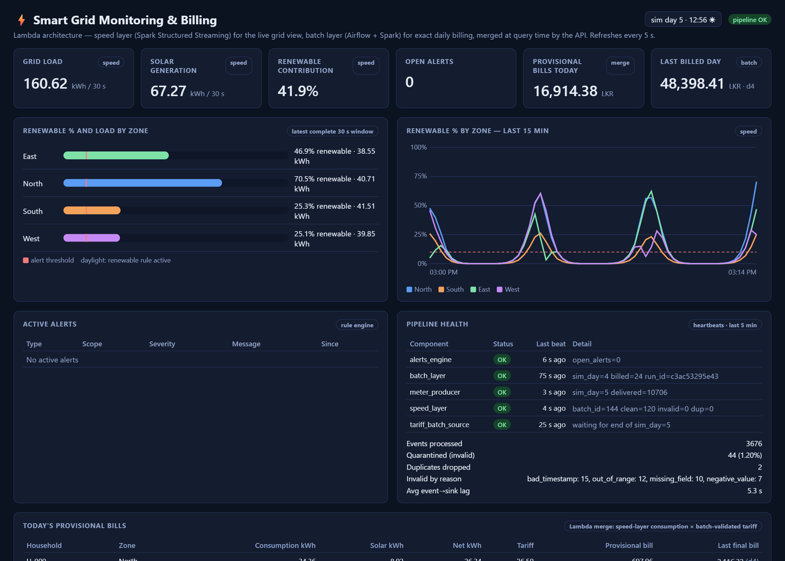

**Spark UI** — the two Structured Streaming queries (`zone_metrics`, `raw_lake`).

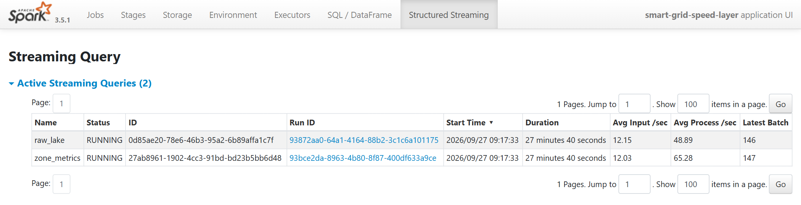

**Airflow** — the `daily_batch_pipeline` DAG: grid of runs and task graph.

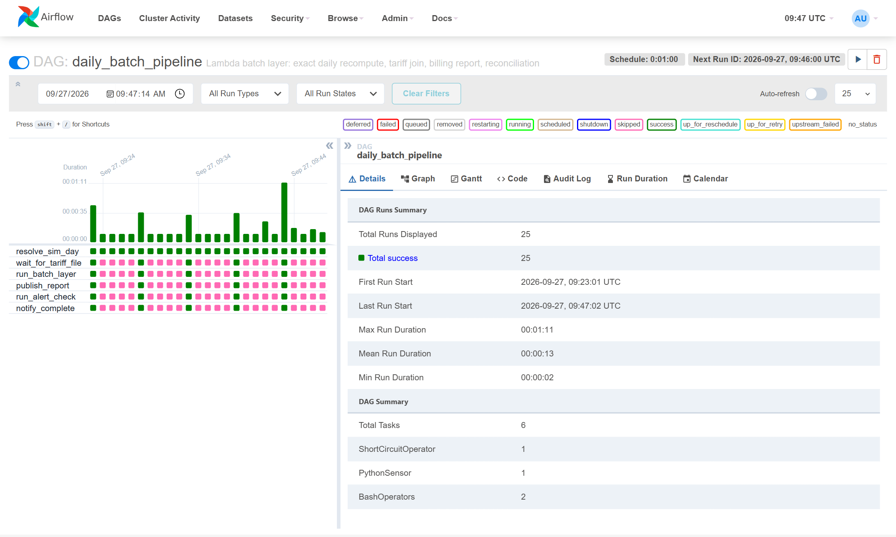

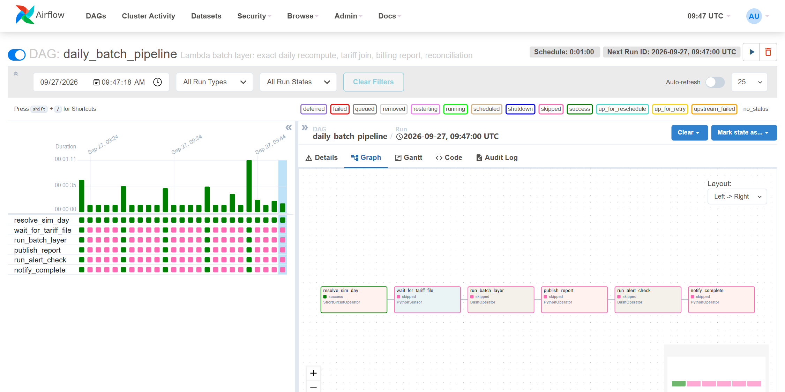

**Daily consolidated report file** — written by the `publish_report` task.

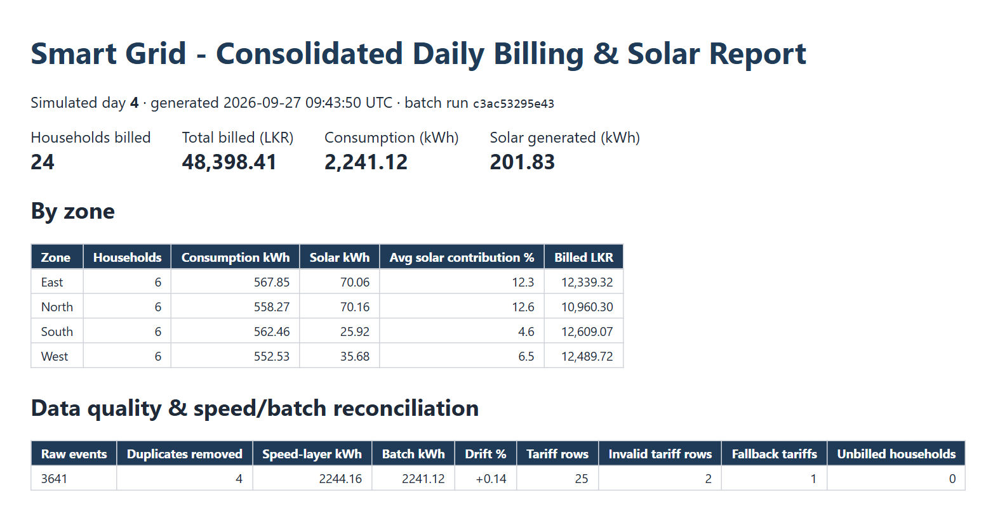

**REST API** — live zone view and the Lambda merge (provisional bill).

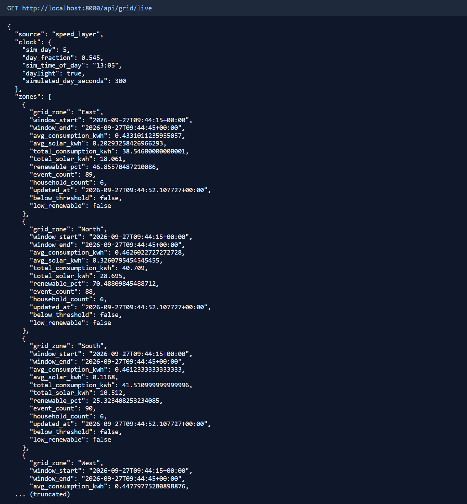

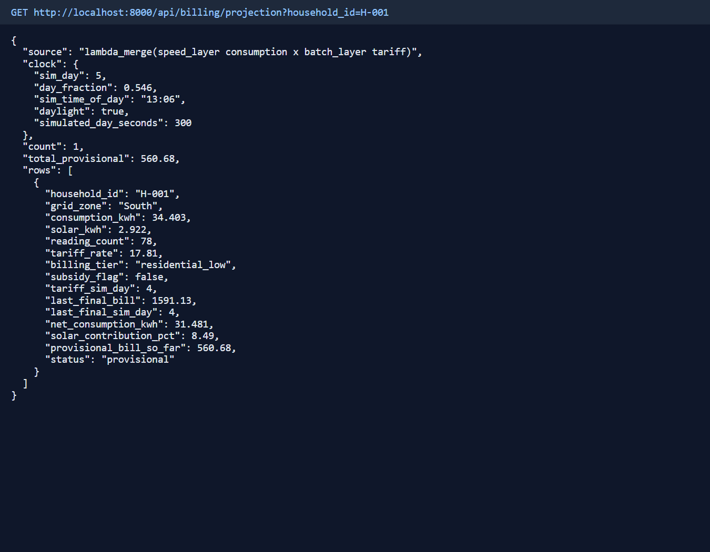

**Failure drill** — producer stopped: pipeline `DEGRADED`, `NO_DATA` alerts, stale components.

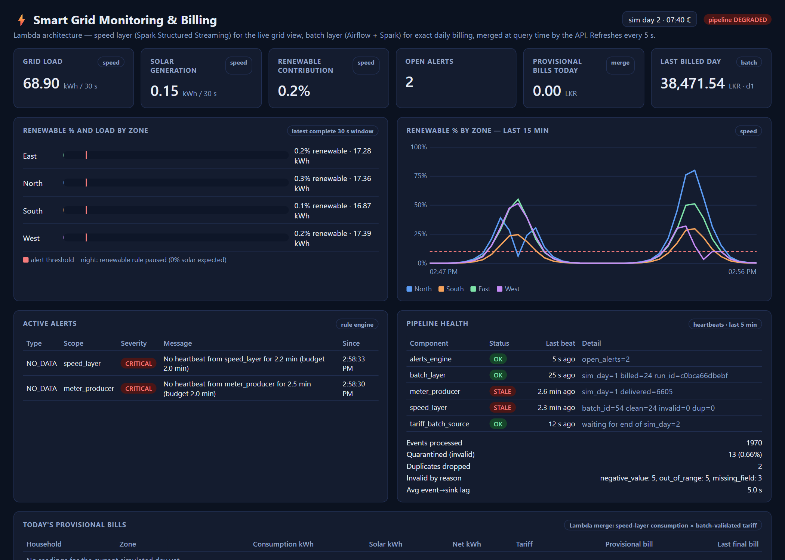

**Prometheus** — alert rules and scrape targets.

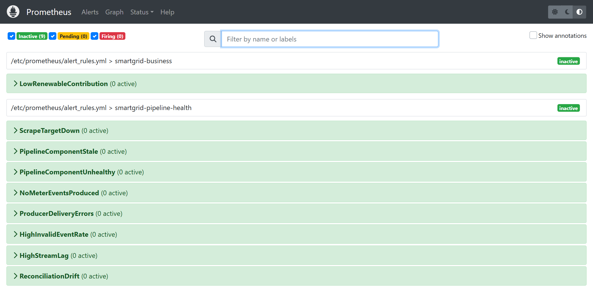

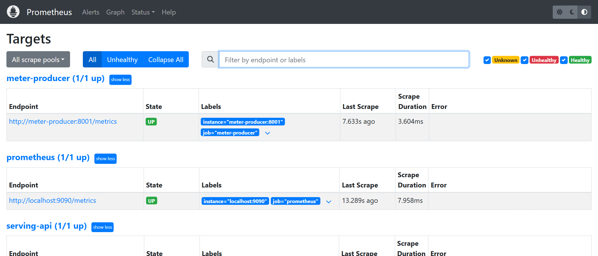

**OpenAPI docs** at `/docs`.

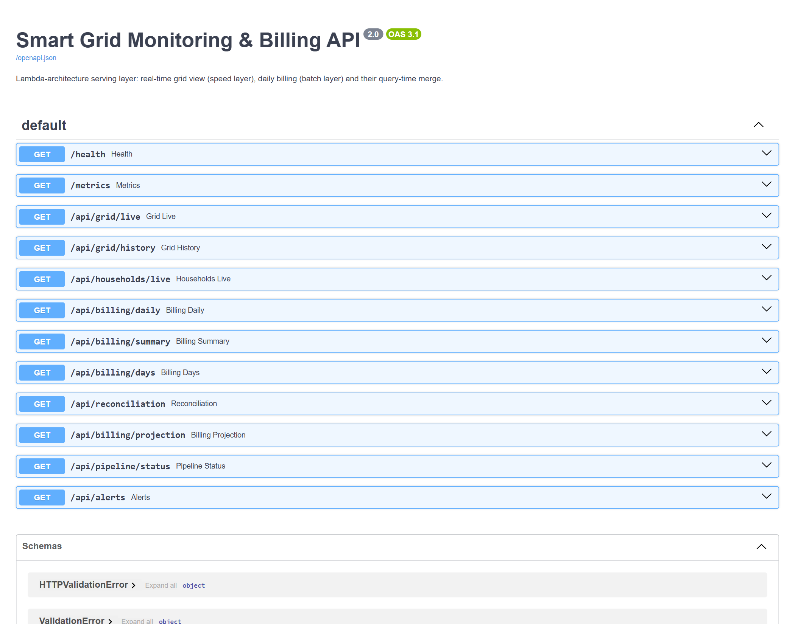

---

## Repository layout

```
README.md                         # this file
images/                           # copies of the diagrams/screenshots shown in this README
smart-grid-pipeline/
  config.py                       # single source of configuration (env-var overridable)
  common/sim_clock.py             # shared simulated clock (epoch stored in Postgres)
  sources/
    smart_meter_producer.py       # streaming source -> Kafka (+ Prometheus metrics :8001)
    tariff_batch_source.py        # daily-batch source -> CSV drop + _SUCCESS marker
  processing/
    speed_layer_spark.py          # Structured Streaming: validate, window, lake, running totals
    batch_layer_spark.py          # Spark batch: dedup, exact totals, tariff join, bill, reconcile
    quality_rules.py              # data-quality rules (shared by Spark + tests)
    billing_rules.py              # billing formula (shared by Spark, API + tests)
  airflow/dags/daily_batch_pipeline_dag.py
  serving/
    api/main.py                   # FastAPI serving layer (speed, batch, merge, observability)
    dashboard/index.html          # live dashboard
    report_generator.py           # scheduled daily CSV + HTML report files
  observability/
    logging_config.py             # structured JSON logging
    heartbeat.py                  # component heartbeats -> pipeline_health
    alerts.py                     # alert rule engine
    metrics.py                    # Prometheus metric definitions
    prometheus/                   # prometheus.yml + alert_rules.yml
  storage/init.sql                # PostgreSQL schema
  scripts/
    smoke_test.py                 # end-to-end check against the running stack
    failure_drill.py              # automated stop/detect/recover drill
  tests/                          # unit tests (no infrastructure needed)
  docs/DEMO_SCRIPT.md             # demo walkthrough
  report/                         # report PDF/DOCX, diagrams, screenshots, generators, captured results
  reports/                        # generated daily report files (runtime output)
  logs/                           # component log files (runtime output)
  docker-compose.yml, Dockerfile.app / .spark / .airflow, .env.example
  requirements*.txt
```

## Troubleshooting

| Symptom | Fix |
|---|---|
| A port is already in use | stop the other program, or change the host port in `docker-compose.yml` (Postgres: `POSTGRES_HOST_PORT` in `.env`) |
| Containers keep restarting / Spark is killed | give Docker Desktop more memory (≈6 GB) |
| Dashboard shows no data | wait ~30 s after start-up; check `docker compose logs spark-speed-layer` |
| No bill / no report file yet | the first bill appears ~6 min after start-up; check the DAG in Airflow |
| Spark UI (`:4040`) doesn't load | the speed layer is still starting (it downloads the Kafka connector on first run); check `docker compose ps spark-speed-layer` |
| Airflow login fails | wait until `docker compose logs airflow` shows the webserver is up; credentials are `admin` / `admin` |
| Want to start completely fresh (day 0) | `docker compose down -v` then `docker compose up --build -d` |
| Old report files from previous runs in `reports/` | delete them (`rm reports/daily_*`, or `Remove-Item reports\daily_*` in PowerShell) — day numbers restart after `down -v` |

## Limitations

Single-broker Kafka (RF=1), Spark in `local[2]` mode, Airflow standalone
(SequentialExecutor + SQLite), a Docker-volume data lake instead of S3/HDFS,
at-least-once delivery (duplicates are removed in the batch layer, not the
speed layer), no authentication on the API/dashboard, and a `LOW_RENEWABLE`
rule without hysteresis (it can flap near the threshold). See the report,
section 9, for the production-scale changes (multi-broker Kafka with a schema
registry, Spark on a cluster, Delta/Iceberg lake, Alertmanager/Grafana,
OpenTelemetry tracing, API authentication).

## Team

| Member | Registration no. | Main contributions |
|---|---|---|
| Sewvandi M.A.K. | EG/2021/4808 | architecture decision and system design; Spark speed and batch layers; Airflow orchestration; PostgreSQL schema; report |
| Peiris P.R.S. | EG/2021/4706 | data simulators; Kafka ingestion; REST API and dashboard; observability; Docker Compose; tests and results capture |
